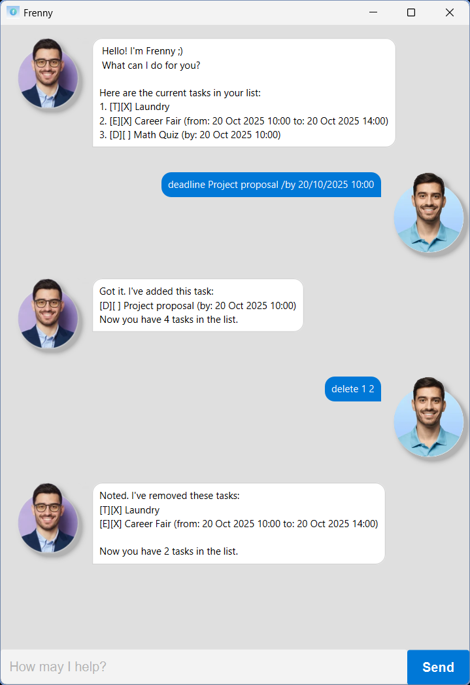

# Frenny User Guide


A fren who manages your tasks - a fren you can trust.
 
## List tasks
- `list`  
```Here are the tasks in your list:
1.[T][ ] return book
2.[D][ ] buy book (by: Oct 20 2025 18:00)
3.[E][ ] project meeting (from: Oct 20 2025 18:00 to: Oct 20 2025 20:00)
```

## Add Todo
- `todo DESCRIPTION`  
e.g `todo return book`  
```Got it. I've added this task:
  [T][ ] return book
Now you have 1 task in the list.
```

## Add Deadline

- `deadline DESCRIPTION /by DATE TIME`  
e.g `deadline return book /by 20/10/2025 18:00`
```  
Got it. I've added this task:
  [D][ ] return book (by: Oct 20 2025 18:00)
Now you have 1 task in the list.
```

## Add Event
- `event DESCRIPTION /from DATE TIME /to DATE TIME`  
e.g `event project meeting /from 20/10/2025 18:00 /to 20/10/2025 20:00`  
```
Got it. I've added this task:
    [E][ ] project meeting (from: Oct 20 2025 18:00 to: Oct 20 2025 20:00)
Now you have 1 task in the list.
```

## Mark & Unmark tasks
- `mark INDICES`  
e.g `mark 1 2 3`  
```
Nice! I've marked this task as done:
  [T][X] return book
  [D][X] buy book (by: Oct 20 2025 18:00)
  [E][X] project meeting (from: Oct 20 2025 18:00 to: Oct 20 2025 20:00)
```  
- `unmark INDICES`  
e.g `unmark 1 2 3`  
```
OK, I've marked this task as not done yet:
  [T][ ] return book
  [D][ ] buy book (by: Oct 20 2025 18:00)
  [E][ ] project meeting (from: Oct 20 2025 18:00 to: Oct 20 2025 20:00)
```

## Delete tasks
- `delete INDICES`  
e.g `delete 1 2 3`  
```
Noted. I've removed this task:
  [T][ ] return book
  [D][ ] buy book (by: Oct 20 2025 18:00)
  [E][ ] project meeting (from: Oct 20 2025 18:00 to: Oct 20 2025 20:00)
Now you have 0 tasks in the list.
```

## Find tasks
- `find KEYWORDS`  
e.g `find book`  
```Here are the matching tasks in your list:
1.[T][ ] return book
2.[D][ ] buy book (by: Oct 20 2025 18:00)
```

## Edit task
- `edit INDEX`  
e.g `edit 1`  
- Follow the prompt to edit the task.

## Exit
- `bye`  
```
Bye. Hope to see you again soon!
```